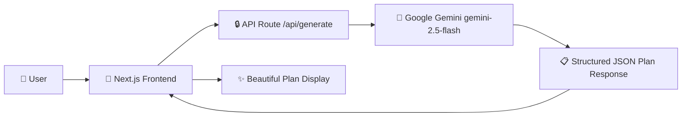

# 🌧️ MonsoonReady

**AI-Powered Monsoon Preparedness for Every Indian Family**


<!-- Add screenshot here -->

---

## 🌊 Problem Statement

India's monsoon season affects over 1.4 billion people annually, causing flooding, waterborne diseases, infrastructure damage, and loss of life. Despite its predictability, most families lack **personalized, actionable preparedness plans** tailored to their specific location, housing type, and family needs. Generic advisories fail to address individual circumstances, leaving millions under-prepared.

## 💡 Solution

**MonsoonReady** uses Google's Gemini AI to generate **hyper-personalized monsoon preparedness plans** in seconds. By understanding your city, family composition, housing type, and specific concerns, it creates tailored action plans with:

- 🛡️ **Before, During & After** monsoon phase-wise guidance
- ✅ **Interactive emergency checklists** with progress tracking
- 📞 **Region-specific emergency contacts** (NDRF, SDRF, local helplines)
- ⚠️ **Safety Do's and Don'ts** customized to your situation
- 🌐 **13 Indian languages** supported for maximum accessibility

## ✨ Features

| Feature | Description |
|---------|-------------|
| 🤖 AI-Powered Plans | Personalized guidance using Google Gemini |
| 🏠 Housing-Aware | Tailored advice for apartments, ground floors, kutcha houses |
| 👨‍👩‍👧‍👦 Family-Centric | Considers family size, elderly, and children needs |
| ✅ Smart Checklists | Interactive checklists with localStorage persistence |
| 🌐 Multilingual | Supports 13 Indian languages |
| 📱 Responsive | Works beautifully on mobile, tablet, and desktop |
| 📄 PDF Export | Download your plan using built-in print-to-PDF |
| 📤 Share | Share via Web Share API or clipboard |
| ♿ Accessible | WCAG AA compliant with semantic HTML and ARIA |
| 🔒 Secure | Server-side API key, input validation, rate limiting |

## 🛠️ Tech Stack

| Technology | Purpose |
|------------|--------|
| [Next.js 15](https://nextjs.org/) | React framework with App Router |
| [Google Gemini](https://ai.google.dev/) | AI model for plan generation |
| Vanilla CSS | Styling with CSS Modules |
| Vercel | Deployment platform |

## 🏗️ Architecture



## 🚀 Getting Started

### Prerequisites

- Node.js 18+ installed
- A Google Gemini API key ([Get one here](https://aistudio.google.com/apikey))

### Installation

```bash
# Clone the repository
git clone https://github.com/your-username/monsoon-ready.git
cd monsoon-ready

# Install dependencies
npm install

# Set up environment variables
cp .env.example .env.local
# Edit .env.local and add your GEMINI_API_KEY

# Start the development server
npm run dev
```

Open [http://localhost:3000](http://localhost:3000) in your browser.

## 🌐 Deployment

### Deploy to Vercel (Recommended)

1. Push your code to GitHub
2. Go to [vercel.com](https://vercel.com) and import your repository
3. Add the environment variable `GEMINI_API_KEY` in the Vercel dashboard
4. Click **Deploy**

[](https://vercel.com/new/clone?repository-url=https://github.com/your-username/monsoon-ready&env=GEMINI_API_KEY&envDescription=Your%20Google%20Gemini%20API%20Key)

## 🔒 Security

- **API Key Protection**: Gemini API key is used exclusively server-side via Route Handlers
- **Input Validation**: All inputs are validated and sanitized server-side
- **Rate Limiting**: In-memory rate limiter (10 requests/IP/minute)
- **Security Headers**: X-Content-Type-Options, X-Frame-Options, Referrer-Policy configured via next.config.mjs

## ♿ Accessibility

- Semantic HTML with proper heading hierarchy
- All interactive elements have descriptive `aria-labels`
- Skip-to-content navigation link
- WCAG AA color contrast compliance
- Keyboard navigable with visible focus indicators
- `aria-live` regions for dynamic content updates
- Respects `prefers-reduced-motion` for users with motion sensitivity

## 🗺️ Future Roadmap

- 🌤️ **Real-time Weather Integration** — Live weather data and automated alerts
- 📲 **Push Notifications** — Proactive alerts before severe weather events
- 📱 **PWA Support** — Install as a native app with offline checklist access
- 👥 **Community Features** — Share preparedness tips and local flood reports
- 🗺️ **Flood Zone Mapping** — Interactive maps showing risk areas
- 🏥 **Healthcare Integration** — Nearby hospital and shelter locations

## 📄 License

This project is licensed under the MIT License — see the [LICENSE](LICENSE) file for details.

---

<p align="center">
  <strong>Built with ❤️ for PromptWars Hackathon</strong><br>
  Powered by Google Gemini | Deployed on Vercel
</p>
